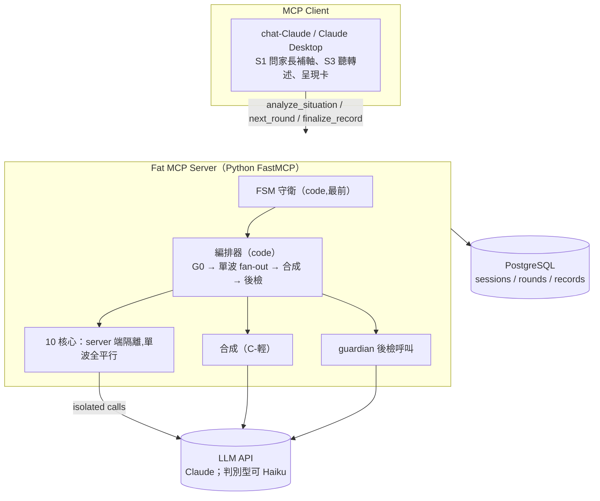
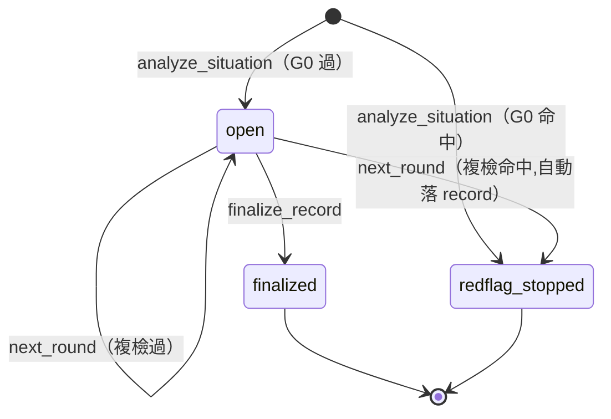
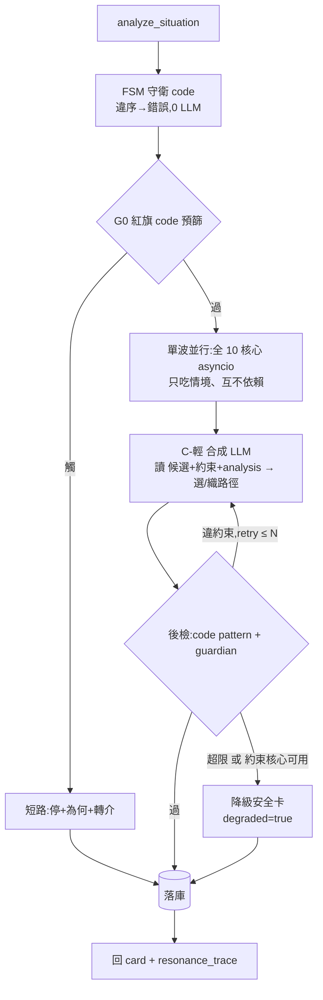

# parenting-response MCP 規格 (v2.2)

> Fat MCP server:10 個理論核心**單波全平行、完全獨立**(只吃情境、互不依賴),直接進 C-輕 合成;硬 fence = G0 紅旗(情境)+ 後檢(產出)兩道 code 閘,把 LLM 合成夾在中間。Tool 呼叫順序 = **server 端 FSM,code 強制,不得違反**。人在迴圈執行,L0 紀錄落 PostgreSQL 供 L1–L4。

## 背景與動機

v2 用兩波(産招 → 約束否決候選),約束等候選 = 依賴,破壞「完全獨立」。v2.1 改單波 + veto 事後檢。v2.2 不動架構,收斂覆盤發現的邏輯錯誤,並把呼叫順序從約定升級為 server 端狀態機。

## v2.1 → v2.2 變更

| # | 變更 | 性質 |
|---|---|---|
| A1 | G0 命中落庫:寫 `sessions(redflag_stopped)`、rounds 零列;`AnalyzeResult.card/trace` 可空 | 邏輯修正 |
| A2 | `analyze_situation` 加 `linked_plan_id`;promotion 鏈 = 同 case 不同 session,明文排除於非目標「跨 session 記憶」外 | tool 簽名（觸發 minor 版號） |
| A3 | records 理論欄位 / sessions 推導欄位 = server 於 finalize / analyze 聚合回填,規則入 `record-schema.md` | 來源補定義 |
| A4 | 術語統一:同模 = 同 model string / 同家族 = 同 vendor / 異質 = 跨 vendor;guardian 可用 Haiku（同家族不同模） | 矛盾消解 |
| A5 | 約束核心可用數 < K（K=2）→ 降級安全卡,不出正常卡 | 安全縫修補 |
| FSM | Tool 呼叫順序 server 端強制:[2]→[3]\*→[4];G0 複檢進 `next_round`;`records UNIQUE(session_id)` | 新增節 |
| B1–B4 | `emotion/emotion_intensity` NOT NULL;components 補 2 檔;架構圖補 SYN 節點;成本補 retry 上界 +2N | 勘誤 |
| C1–C3 | 終態呼叫 = 明確錯誤;converged 判準下放 pingpong.md;0-2 帶明列範圍外 | 邊界補述 |
| 語言 | 選型定案:Python 3.12+ / fastmcp 2.x;技術棧 pin pyright strict + uv + in-memory 測試;決策表 rationale 補強(安全保證語言無關 → 生態決勝) | 選型定案 |
| 縫補 | `next_round` 加 `reaction_note`(G0 複檢對象);核心輸入嚴格隔離(卡文/linked_plan 僅合成可見);G0 詞表分短路/警訊兩級 | 規格縫修補 |

## 目標 / 非目標

| | 內容 |
|---|---|
| 目標 | 核心單波全獨立隔離;硬 fence(G0+後檢)code 強制;**tool 順序 FSM code 強制**;C-輕 合成;L0 持久化 PG;S0–S4 + 乒乓 + rehearsal/live + promotion |
| 非目標(v2.2) | L1–L4 聚合程式、核心真去相關(異質底模)、跨 session 記憶讀取(**promotion 鏈 `linked_plan_id` 屬同 case 生命週期,不在此限**) |

## 設計依據

- 架構/核心/家族/L0 欄位/路線圖/風險 → `parenting-response-spec-v2.md`
- 合成折算細則 / trace schema → `resonance-c-light.md`
- 反模式語料(輸入端 confounders / 輸出端 fence 詞表) → `references/tw-parenting-antipatterns.md`
- 本文件只規範 **MCP 實作**,不重述以上。

## 關鍵決策

| 決策 | 取捨方案 | Rationale |
|---|---|---|
| 單波全獨立(v2.1) | 兩波 / 單波 | 兩波讓約束依賴産招候選 = 破壞獨立 + 多序列等待 |
| veto 事後檢產出 | 事前濾候選 / 事後檢產出 | 湧現違規(候選各自乾淨、織起來踩線)只有檢產出抓得到 |
| **順序 = server 端 FSM(v2.2)** | prompt 約定 / code 強制 | 與硬 fence 同哲學:凡「不得違反」的不交給 LLM 自律;違序在 LLM 呼叫前攔截,兼省成本 |
| **DB 不變量第二道(v2.2)** | 僅 code 守衛 / code+DB | 守衛可能有 bug、可能被繞過;不變量是最後防線 |
| **G0 複檢進 next_round(v2.2)** | 只在 analyze / 每入口 | S3 轉述可能才暴露紅線;每個入口都是檢查點 |
| **promotion 經 analyze 參數(v2.2)** | finalize 指定 / analyze 指定 | 開局即知「照哪份預演打」,乒乓可讀 linked plan 脈絡 |
| 核心 = server 內部呼叫(不暴露) | 暴露 tool / 內部 | 暴露 = 編排回到 client LLM 自由心證 |
| Fat server | thin / fat | 紅旗/後檢/FSM 要 code 保證 |
| 狀態 = PostgreSQL | client 帶狀態 / PG | session+round+record 同庫,L1–L4 native |
| Python 3.12+ / fastmcp 2.x(定案) | Rust / Go / TS / Python | 安全保證(FSM 守衛、G0、後檢、DB 不變量)全在 runtime/DB 層,語言無關 → 編譯期型別無兌現處;負載純 I/O bound;決勝在生態:prompt 迭代、in-memory 測試、L1–L4 數據棧、中文語料工具皆 Python 最順。TS 為唯一對等候補(主力在 Node 或需共用 web 層時成立);維護者兩邊皆生 → 生態 fit 主導 |
| 同模 + 家族折算 | 同模 / 異質 | 同模仍相關 → 折算不可拿掉;異質 → backlog |
| 折算 LLM 軟套用(C-輕) | code 評分 / LLM | 需語意一致性;硬規則靠 G0+後檢 code |

## 系統架構



## 元件職責

| 元件 | 職責 | 形式 |
|---|---|---|
| chat-Claude(client) | 對話:S1 問齊軸、S3 聽轉述、呈現卡 | prompt |
| FSM 守衛 | 驗 session 狀態與呼叫順序,違序即擋(先於一切 LLM) | Python code |
| 編排器 | G0 預篩/複檢、單波 fan-out、收集、呼叫合成、後檢、寫 PG、finalize 聚合回填 | Python code |
| 核心 ×10 | 單波全平行、各自隔離:産招出候選 / 觀點出分析 / 約束出約束+分析 | server 端 LLM 呼叫 |
| 合成 | C-輕(見 resonance-c-light) | 1 次 LLM 呼叫 + code 貼標 |
| guardian 後檢 | 驗產出是否違約束(語意項) | code pattern + 1 次 LLM 呼叫 |
| PG | session / round / record 持久化 + 不變量 | DB |

## Tool 介面契約

對外**只暴露編排入口**;核心不暴露。S1 補軸、S3 聽轉述由 client 負責。

```python
analyze_situation(                          # S2（內含 G0）
    mode: Literal["live", "rehearsal"],
    age_band: Literal["2-3", "4-6", "7-11", "12+"],
    facts: str,
    emotion: str,
    emotion_intensity: Literal["低", "中", "高"],
    safety_flag: bool = False,
    problem_category: str | None = None,    # 受控詞表
    confounders: list[str] | None = None,   # 詞源見 tw-parenting-antipatterns.md
    parent_goal: str | None = None,
    child_id: str = "C1",
    linked_plan_id: str | None = None,      # v2.2：live 引用 rehearsal 的 record_id（promotion 鏈）
) -> AnalyzeResult
# 內部: FSM 守衛 → G0 → 單波 fan-out（全 10 核心隔離）→ C-輕 合成 → 後檢 → 寫 sessions+rounds(round 0)
# AnalyzeResult = { session_id, card: Card | None, resonance_trace: Trace | None,
#                   redflag: {hit, reason, referral} | None }
# 不變量：redflag.hit=true ⟺ card/trace = None（G0 短路,只寫 sessions）

next_round(session_id: str, child_reaction: str,
           reaction_note: str | None = None) -> RoundResult   # S3 乒乓
# child_reaction ∈ {鬆動配合,否認堅持,情緒爆發,退縮害怕,反問試探,轉移打岔}
# reaction_note = 家長轉述自由文本（孩子說/做了什麼、家長實際說了什麼）
#                 —— G0 複檢對象 + 核心輸入的現實事件來源（縫補）
# FSM 守衛 → G0 複檢（對 reaction_note;空則對 child_reaction 字面）→ 點火相關核心（單波）→ 重合成 → 後檢 → append round
# RoundResult = { card: Card | None, resonance_trace: Trace | None, converged: bool,
#                 redflag: {hit, reason, referral} | None }
# G0 複檢命中：自動落 record(outcome=escalated_to_redflag)、session 轉終態,card/trace = None

finalize_record(                            # S4
    session_id: str,
    outcome: Literal["resolved", "partial", "unresolved", "escalated_to_redflag"],
    outcome_note: str | None = None,
    parent_self_note: str | None = None,
    followup: str | None = None,
) -> { record_id }
# server 自 rounds 聚合回填理論欄位（A3,規則見 record-schema.md）;
# session 帶 linked_plan_id 且 mode=live → record.status=done_from_plan 自動鏈結

# 未來 L1–L4：query_records(filter) / periodic_report(window)
```

必填軸 = `mode / age_band / facts / emotion / emotion_intensity`;缺 → `E_MISSING_AXIS`,不建 session。

## Tool 呼叫順序(FSM,v2.2 新增)

> 順序是**狀態機,不是約定**。違序呼叫由 FSM 守衛在進入核心前以 code 擋下:明確錯誤、零核心呼叫、零 LLM 成本。

```text
[1] S1 補軸(client)── server 以「必填軸驗證」作 code 代理:缺軸 → 不建 session
[2] analyze_situation ── 唯一合法 session 起點,round 0
[3] next_round ×0..n  ── 僅 status=open;round_no 嚴格遞增
[4] finalize_record   ── 僅 status=open 且 round 0 存在;成功後終結
不得違反:[2] → [3]* → [4],無跳關、無回頭、無重入
```



兩終態(`finalized` / `redflag_stopped`)為吸收態:其上任何 tool 呼叫一律 `E_INVALID_STATE`。

### 轉移守衛表(orchestrator 進入點,先於一切 LLM 呼叫)

| Tool | 前置守衛(全部 code 斷言) | 違反處置 |
|---|---|---|
| analyze_situation | 必填軸齊全;`session_id` 由 server 生成,不接受外部指定;`linked_plan_id` 若給,須指向存在且 `status=planned` 的 record | `E_MISSING_AXIS` / `E_INVALID_LINK` |
| next_round | session 存在 ∧ `status=open` ∧ round 0 存在;`child_reaction` ∈ 六類;對 `reaction_note`(空則 child_reaction 字面)重跑 G0 | `E_INVALID_STATE` / `E_INVALID_REACTION` |
| finalize_record | session 存在 ∧ `status=open` ∧ round 0 存在;`outcome` ∈ 受控詞表 | `E_INVALID_STATE` |

### 雙保險

```text
第一道（code 守衛）: orchestrator 進入點斷言,如上表          —— 邏輯層
第二道（DB 不變量）:                                          —— 守衛有 bug 也擋住
  rounds PK (session_id, round_no)        → 重複輪次寫入必失敗
  round_no 由 server 取 max(round_no)+1   → client 無法指定輪次
  records UNIQUE(session_id)              → 一 session 至多一 record（防重複 finalize）
  status 以 UPDATE ... WHERE status='open' 條件式轉移
                                          → 併發雙 finalize 恰一成功
```

promotion 與 FSM 相容:`analyze_situation(linked_plan_id=...)` 開**新 session、新 FSM 實例**,鏈結只在 record 層;不存在「rehearsal session 復活成 live」的轉移。

## 核心呼叫契約

**單波,全核心對稱:情境 in → 輸出 out,互不參照。**

```text
全核心 ← 結構化情境(only)         # 隔離保證點:不含任何其他核心輸出、不含候選
  産招(PD/Dreikurs/Gottman/NVC/Rogers) → { candidate{posture, utterance}, analysis, confidence }
  觀點(Adler)                          → { analysis }                  # 私人邏輯/歸屬,不出候選
  約束(Maslow/Satir/Erikson/Piaget)    → { analysis, constraints[] }   # 出約束,不對候選投票
```

約束物件(供合成當硬要求 + 供後檢當檢查表):

```text
constraint = {
  type,          # 需求不踩底 | 不損自我 | 不超齡-心理社會 | 不超齡-認知
  rule,          # situation-grounded 文字,如「不得犧牲 歸屬 換取矯正」
  checkable_by   # pattern（禁用詞,code）| guardian（語意,LLM）
}
```

家族(供折算)、角色:見 `parenting-response-spec-v2.md`。隔離 = 每核心一次獨立 API 呼叫,無共享 context。
**嚴格隔離面(縫補)**:歷輪卡文與 linked_plan 摘要**僅合成可見**,核心不可見;現實事件(家長實際說了什麼、孩子怎麼回)一律經家長轉述(`reaction_note`)進入情境。

## 編排管線

**FSM 守衛 → 單波全獨立 → 直接合成 → 後檢把關。沒有候選否決階段。**



落庫分流(A1):

| 路徑 | sessions | rounds |
|---|---|---|
| G0 短路 | 1 列,`status=redflag_stopped` | 零列 |
| 正常 / 降級 | 1 列,`status=open` | round 0(降級時 `degraded=true`) |

後檢流程:

```text
1. code pattern:輸出含禁用標籤詞（詞表見 tw-parenting-antipatterns.md 輸出端投影）? → fail
2. guardian LLM:給 {全 constraints, card} → 列違反項（不踩底/不超齡語意）
3. 任一 fail → 退回 SYN 重生（retry ≤ N）
4. N 次仍 fail 或 約束核心可用數 < K → 降級安全卡（不硬出）
```

`next_round`:同管線,差三處——守衛多查 `status=open`、G0 改對 `reaction_note` 轉述文本複檢(命中 → 自動落 record `escalated_to_redflag` + 轉終態)、fan-out 換 pingpong 路由的點火子集(見 `references/pingpong.md`),append round。

`finalize_record`:不進 LLM 管線——守衛 → 自 rounds 聚合回填理論欄位 → 寫 record → `status=finalized`。

## 資料模型 / PG schema

L0 持久化的穩定契約。`records.schema_version` 必填;遷移走 Alembic。詞語意 → `record-schema.md`。

```sql
-- 一次育兒處理（S0–S4 生命週期）
CREATE TABLE sessions (
    session_id        TEXT PRIMARY KEY,           -- uuid,server 生成
    child_id          TEXT NOT NULL,              -- 代號,不放真名
    mode              TEXT NOT NULL,              -- live | rehearsal
    status            TEXT NOT NULL,              -- open | finalized | redflag_stopped
    created_at        TIMESTAMPTZ NOT NULL DEFAULT now(),
    age_band          TEXT NOT NULL,              -- 2-3|4-6|7-11|12+（0-2 刻意範圍外）
    facts             TEXT NOT NULL,
    emotion           TEXT NOT NULL,              -- v2.2: 補 NOT NULL（必填軸,B1）
    emotion_intensity TEXT NOT NULL,              -- 低|中|高（B1）
    safety_flag       BOOLEAN DEFAULT false,
    severity          TEXT,                        -- 低|中|高,server 自 G0/約束分析推導（A3）
    is_positive_log   BOOLEAN DEFAULT false,      -- server 推導（A3）
    problem_category  TEXT,
    confounders       JSONB,
    parent_goal       TEXT,
    goal_aligned      BOOLEAN,                    -- server 於 finalize 對照 parent_goal 推導（A3）
    linked_plan_id    TEXT                         -- v2.2: promotion 鏈,analyze 傳入（A2）
);

-- S2 初次（round 0）+ S3 每輪乒乓
CREATE TABLE rounds (
    session_id      TEXT REFERENCES sessions(session_id),
    round_no        INT NOT NULL,                 -- 0 = S2;server 取 max+1,client 不可指定
    child_reaction  TEXT,                          -- round 0 為 null;之後 ∈ 六類
    reaction_note   TEXT,                          -- S3 轉述自由文本;G0 複檢對象 + 核心輸入的現實事件來源（縫補）
    card            JSONB NOT NULL,
    resonance_trace JSONB NOT NULL,                -- 見 resonance-c-light.md
    degraded        BOOLEAN DEFAULT false,        -- 後檢降級 / 約束核心<K 時 true（審計用）
    created_at      TIMESTAMPTZ NOT NULL DEFAULT now(),
    PRIMARY KEY (session_id, round_no)            -- FSM 第二道:重複輪次必失敗
);

-- S4 收尾,L0 紀錄
CREATE TABLE records (
    record_id        TEXT PRIMARY KEY,            -- 日期+序號
    session_id       TEXT UNIQUE REFERENCES sessions(session_id),  -- v2.2: UNIQUE,防重複 finalize
    schema_version   INT NOT NULL DEFAULT 1,
    status           TEXT NOT NULL,               -- planned | done | done_from_plan
    linked_plan_id   TEXT,                         -- done_from_plan 指向 rehearsal 的 record_id
    dreikurs_purpose TEXT,                         -- 關注|權力|報復|自暴自棄  ┐
    maslow_need      JSONB,                        -- [生理|安全|愛與歸屬|尊重] │ A3:finalize 時 server
    erikson_stage    TEXT,                         --                          │ 自 rounds 聚合回填,
    piaget_stage     TEXT,                         --                          │ 規則見 record-schema.md
    dev_normative    BOOLEAN,                      --                          ┘
    outcome          TEXT NOT NULL,
    outcome_note     TEXT,
    parent_self_note TEXT,
    followup         TEXT,
    tools_used       JSONB,                        -- A3 聚合回填
    posture          TEXT,                         -- A3 聚合回填(最終卡 candidate.posture)
    created_at       TIMESTAMPTZ NOT NULL DEFAULT now()
);
```

## 模型策略

術語(A4):**同模 = 同一 model string;同家族 = 同 vendor;異質 = 跨 vendor**。

| 核心/步驟 | 模型 | rationale |
|---|---|---|
| 細膩語感(合成、Satir、Adler) | Sonnet/Opus | 質性深度 |
| 分類/判別(約束分析、Dreikurs) | 可降 Haiku | 偏判別,省成本 |
| guardian 後檢 | Haiku(同家族不同模) | 與合成不同 model string,降低同模盲點;同家族是否足夠,P0 測試驗證 |
| 異質底模(真去相關,跨 vendor) | backlog | — |

成本:一次 `analyze` ≈ 單波 10 核心(並行)+ 合成 1 + guardian 1 ≈ **12 次,retry 上界 +2N**(每次重生 = 合成 1 + guardian 1)。`next_round` = 點火部分核心 + 合成 + guardian(+2N 上界同)。每核心模型 config 可配。

## 硬 fence / 安全邊界

兩道 code 閘夾住 LLM 合成;FSM 守衛在更外圈。

```text
FSM 守衛（順序,code,最外）   : 違序 → 明確錯誤,零 LLM
G0 紅旗（情境,code）         : analyze 命中 → 短路;next_round 對 reaction_note 複檢,命中 → 自動收案轉終態
                               詞表兩級（縫補）: 短路級（停案+轉介）/ 警訊級（不停案,severity 升「高」）→ tw-parenting-antipatterns.md
後檢（產出,code+guardian,最後）:
    pattern（禁用標籤詞,code）+ guardian（不踩底/不超齡,LLM）
    違約束 → 重生（retry ≤ N）;上限 或 約束核心可用<K → 降級安全卡
```

❌ 把紅旗/約束/順序交給 LLM 自律
✅ FSM、G0、後檢永遠把關;合成可看到不理想候選,但**違約束的產出出不了後檢**
✅ 後檢檢「織出的最終卡」,連湧現違規(候選各自乾淨、組合踩線)都攔得到
✅ 約束核心半殘(可用 < K)時不假裝正常——降級,不讓空檢查表放行

> 約束核心的 `analysis` 進合成當脈絡、`constraints` 進後檢當檢查表。
> G0 詞源、pattern 禁用詞表、confounders 詞源:`references/tw-parenting-antipatterns.md`(雙消費端:輸入端全 8 家族、輸出端僅 F2/F3/F5 語言投影)。

## 技術棧 / 專案結構

```text
Python 3.12+ + fastmcp 2.x   # 獨立套件(非官方 mcp 內建 FastMCP):取 in-memory Client,驗收測試不起 subprocess
asyncio                      # 單波核心並行(純 I/O bound,gather 即可)
anthropic SDK                # 核心 + 合成 + guardian
psycopg3(async)+ Alembic     # PG + 遷移;不變量見資料模型節
pydantic v2                  # tool I/O + 受控詞表 + constraint schema;Literal 值域 = 框架層第一道擋(含 0-2 帶)
pyright(strict)+ uv          # 補 runtime-only 型別弱點:內部路徑近編譯期檢查;lock 重現環境
pytest + fastmcp Client      # 20 條驗收:in-memory 直打 tool、mock anthropic → 可斷言「違序 LLM 呼叫 = 0」

src/
├── server.py          # FastMCP,3 tools
├── orchestrator.py    # FSM 守衛 → G0 → 單波 fan-out → 合成 → 後檢 → 聚合回填（code）
├── cores/             # 10 核心 system prompt + 呼叫封裝（單波,情境 in）
├── synthesis.py       # C-輕 合成呼叫 + 貼標
├── postcheck.py       # pattern 檢 + guardian 呼叫 + 重生/降級
├── redflag.py         # G0 預篩 + next_round 複檢
├── schema.py          # 受控詞表 + constraint + pydantic models + 錯誤碼
├── db.py              # PG（psycopg3）+ 不變量
└── migrations/        # Alembic
references/
├── cores/<name>.md            # 各核心 prompt（産招話術 / 約束規則）—待產
├── resonance-c-light.md       # 合成契約—已產
├── record-schema.md           # L0 欄位 + 詞表 + A3 聚合回填規則—待產
├── pingpong.md                # S3 反應路由 + converged 判準—待產
└── tw-parenting-antipatterns.md  # 反模式語料 F1–F8 / P01–P50,雙消費端—待產
```

## 錯誤處理

不靜默失敗。錯誤碼:`E_MISSING_AXIS / E_INVALID_STATE / E_INVALID_REACTION / E_INVALID_LINK`。

| 情況 | 處置 |
|---|---|
| 缺必填軸 | `E_MISSING_AXIS`,不建 session,不臆測 |
| session 不存在 / 已終態 / round 順序錯 | `E_INVALID_STATE`,零核心呼叫 |
| child_reaction 非六類 | `E_INVALID_REACTION` |
| linked_plan_id 指向不存在 / 非 planned 的 record | `E_INVALID_LINK` |
| 核心呼叫 timeout/API 失敗 | retry N;仍失敗 → 標 unavailable,合成註記缺席;**産招全失敗 → 回錯誤不出卡** |
| **約束核心可用數 < K(K=2)** | 降級安全卡,`rounds.degraded=true`(A5) |
| 後檢 guardian 反覆判違約束 | retry ≤ N;上限 → 降級「約束摘要 + 安全提醒」,`degraded=true` |

## 驗收條件

核心隔離 / fence:

- [ ] 給定缺必填軸,當 `analyze_situation`,則 `E_MISSING_AXIS`,零核心呼叫
- [ ] 給定 G0 命中,當 `analyze`,則零核心呼叫;sessions 落 1 列 `redflag_stopped`、rounds 零列;回 `card=None`(A1)
- [ ] 給定任一核心呼叫,當執行,則 input 只含情境、不含其他核心輸出或候選(可斷言)
- [ ] 給定約束核心,當執行,則輸出 `constraints[]`,不對任何候選投票
- [ ] 給定每候選單看合規、織起來貼標籤的卡,當後檢,則攔下(湧現違規)
- [ ] 給定輸出含禁用標籤詞,當 pattern 檢,則攔下
- [ ] 給定後檢上限仍違約束,當收尾,則降級安全卡且 `rounds.degraded=true`
- [ ] 給定約束核心可用數 < K,當合成完,則直接降級,正常卡不出(A5)

FSM 順序:

- [ ] 給定不存在的 session,當 `next_round` / `finalize_record`,則 `E_INVALID_STATE`,零核心呼叫
- [ ] 給定 `status=finalized` 或 `redflag_stopped`,當任一後續 tool,則明確錯誤,零核心呼叫
- [ ] 給定併發兩個 `finalize_record`,則恰一成功,records 恰一列
- [ ] 給定 `next_round` 的 child_reaction 含 G0 線索,當執行,則零核心呼叫、轉 `redflag_stopped`、自動落 record `escalated_to_redflag`
- [ ] 給定跳過 analyze 直接 `next_round`,則錯誤(顯式列出防回歸)
- [ ] FSM 守衛先於任何 LLM 呼叫(可斷言:違序請求 LLM 呼叫計數 = 0)

L0 / promotion:

- [ ] 給定 `analyze(mode=live, linked_plan_id=R)`,當 finalize,則 record `status=done_from_plan` 且 `linked_plan_id=R`(A2)
- [ ] 給定 finalize,則理論欄位由 server 自 rounds 聚合回填,非 client 傳入(A3)
- [ ] 給定任一 `records` 列,當讀取,則受控詞表欄位落鎖定值域
- [ ] 每輪 card + resonance_trace 落 `rounds`;finalize 落 `records`

## 漸進載入指引

| 任務 | 查閱 |
|---|---|
| 合成折算細則 / trace schema | `resonance-c-light.md`(已產) |
| 各核心 prompt(産招話術 / 約束規則) | `references/cores/<name>.md`(待產) |
| L0 欄位語意 + 受控詞表 + A3 回填規則 | `references/record-schema.md`(待產) |
| S3 反應 → 點火路由 + converged 判準 | `references/pingpong.md`(待產) |
| G0 詞源 / pattern 詞表 / confounders 詞源 | `references/tw-parenting-antipatterns.md`(待產) |
| 架構 / 家族 / 路線圖 / 風險 | `parenting-response-spec-v2.md` |

## 邊界 / 待議

- **0-2 帶不支援,屬刻意範圍外**(C3;pydantic 直接擋,明確錯誤優於臆測)
- converged 判準下放 `pingpong.md`;撰寫時須納入「討好式順從 ≠ 收斂」(D3),不可天真綁定「鬆動配合」
- 核心真去相關(跨 vendor 異質底模) → backlog;同家族 guardian 是否足避同模盲點 → P0 測試驗證
- L1–L4 聚合程式、`query_records` / `periodic_report` → 未來
- 跨 session 記憶讀取 → 不做(promotion 鏈除外,見非目標)
- 後檢 retry 上限 N、約束可用門檻 K(暫 2)、降級卡內容細節
- 成本上限 / session TTL / 未 finalize 的 open session 清理
