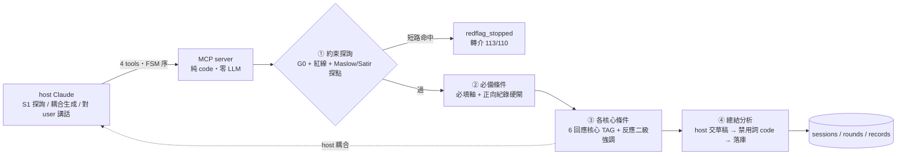
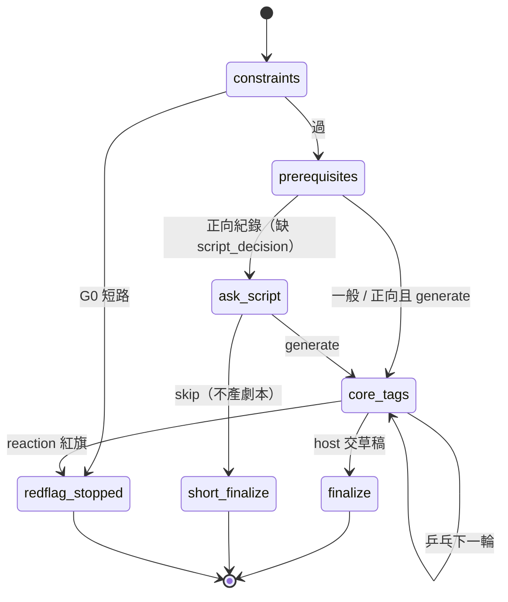

# parenting-response MCP 規格 (v3.0)

> Thin MCP server:**零 LLM 呼叫、零 API key**。對 host 暴露 6 個工具(2026-06 起;初版 4 個),server 端 code 強制呼叫順序與安全閘。學派分兩群:**6 回應核心**以靜態 TAG 由 host 一次耦合生成;**2 探詢核心(Maslow/Satir)**前移約束探詢,做診斷不做回應。隔離降為「輸入素材隔離」而非「per-lens 獨立判讀」,換取零推論成本。
>
> **⚠ 2026-06-12 Amendment 告示:** 正文(2026-06-11 版)所有「G0 短路 → `redflag_stopped` 鎖死」之描述已由文末 **Amendment A 件(G0 閘→訊號)取代**——輸入端永不停案,`redflag_stopped` 不再產生。正文與 Amendment 節衝突處,一律以 Amendment 為準;正文原文保留供歷史對照。

## v2.2 → v3.0 轉向

| 維度 | v2.2 | v3.0 |
|---|---|---|
| 推論 | server 自打 Anthropic API（10 核心隔離並行） | **server 零 LLM**;host 耦合生成 |
| API key | 必須 | **不需要** |
| 隔離 | 真隔離（10 次獨立 fresh-context） | 盡量隔離（靜態 TAG 集乾淨,耦合單次） |
| 學派分工 | 10 核心同質產招 | **6 回應核心(耦合) + 2 探詢核心(診斷,前移①)** |
| 核心輸出 | per-situation 段落判讀 | 靜態理念 TAG（加厚） |
| 後檢 | server 在 path 上硬強制 | host 交草稿軟強制（④） |

> **決策定案:** 真隔離需 MCP sampling,Claude client 不支援 → 排除。省錢勝出。

## 目標 / 非目標

| | 內容 |
|---|---|
| 目標 | 零 API key;4-tool FSM code 強制;G0 硬守;後檢軟守;探詢/回應分群;靜態 TAG 盡量隔離;正向紀錄硬閘短鏈;L0 落庫 |
| 非目標 | 真隔離（需 sampling）;server 端推論;per-lens 獨立判讀;L1–L4 聚合 |

## 架構



## FSM（code 強制,違序 `E_INVALID_STATE`）



## Tool 介面（① → ② → ③* → ④;終態 `finalized` / `redflag_stopped` 與 TTL 棄案 `expired` 皆為吸收態）

| # | tool | 輸入契約 | server（純 code） | 過 → | 不過 → |
|---|---|---|---|---|---|
| ① | `constraints`（約束探詢） | `facts / emotion / mode` | G0 短路紅旗;回禁用詞+紅線約束集 + **Maslow/Satir 探點**（引導 S1） | unlock ② | 短路 → `redflag_stopped` |
| ② | `prerequisites` | `age_band / emotion_intensity / problem_category? / script_decision?` | 驗必填軸;正向紀錄且缺 `script_decision` → 回 ask-gate + 詢問語 | unlock ③（或 skip→short ④） | 缺軸 → `E_MISSING_AXIS` |
| ③ | `core_tags` | `session_id / child_reaction? / reaction_note?` | 回 **6 回應核心 TAG**（標 primary/support）+ Erikson/Piaget 查表;reaction 複檢 G0（**高張力輪強制 reaction_note**,缺則 ask-gate;其餘輪有轉述才複檢）;算 `converged` | unlock ④（可重呼 ×n） | reaction 紅旗 → `redflag_stopped` |
| ④ | `finalize` | `session_id / draft / outcome / claimed_sources`<br/>（short 模式:無 draft） | **自由文本 G0 複檢**（短路 → 轉介必達 + severity↑,案照收）;禁用詞 `pattern_check`（short 略過）;落 record | terminal `finalized` | 含禁用詞 → 拒落庫,回違規詞 |

- `child_reaction ∈ 鬆動配合 \| 否認堅持 \| 情緒爆發 \| 退縮害怕 \| 反問試探 \| 轉移打岔`;round 0 = NULL。
- **正向紀錄硬閘:** `problem_category=正向紀錄` 時,② 在收到 `script_decision ∈ skip\|generate` 前**不解鎖任何後續**;skip → short ④（只記事,不產劇本、不 pattern_check）;generate → 一般鏈。`script_decision` 為必填閘(硬),「是否真有問家長」屬 host 配合(軟)。
- **③ 複檢前提(defect-fixes #4):** `child_reaction ∈ {情緒爆發, 退縮害怕}`(高張力)而缺 `reaction_note` → 回 ask-gate(`requires=reaction_note`),不 insert round、不解鎖——紅旗複檢的風險集中在高張力輪,有效性不可繫於 host 自律;非高張力輪無轉述 → 跳過複檢(已知軟點,如實陳述)。
- **④ G0(defect-fixes #2):** `draft / outcome_note / parent_self_note / followup` 一律複檢(short 模式同樣適用,short 只略過 pattern_check);短路命中**不拒收、不改走 redflag_stopped**——④ 紅旗主體多為家長自陳而非進行中乒乓,鎖案無助益;回傳附 `redflag`/`referral` 且 severity 升「高」(警訊級 → 附 `warnings` + severity 升「高」;G0 訊號不因 pattern 拒收而丟失)。
- **④ 前置(defect-fixes #3):** 一般模式須先 ③ `core_tags` 至少一輪(round 0 起手),否則 `E_INVALID_STATE`——host 未取得任何 TAG 不得交稿,學派引導不可整段繞過;short 模式本就免 ③,不受此守衛影響。
- **棄案 TTL(defect-fixes #6):** open 案自**最後活動**(建案或最近一輪,非單看建案時間——乒乓本就跨日)逾 `SESSION_TTL_DAYS`(預設 30,≤0 停用)天,於下次 ① 懶清掃轉吸收態 `expired`:不產 record、`severity` 留存於 sessions 供 L0 追蹤(警訊訊號不隨棄案消失)。
- **稽核事件(defect-fixes #7/#8):** G0 命中(兩級,①③④)與 ④ pattern 拒收一律落 `events`(append-only):短路記欄位/詞組/前後文節錄/`referral_delivered`,警訊記 (欄位, 詞組) 列,拒收記 violations 與嘗試之 outcome——`severity=高` 與拒收重試皆可重建緣由。「曾接觸紅旗之案」= `events.kind=g0_shortcircuit` ∪ `outcome=escalated_to_redflag`(④ 命中不拒收的列 record 外觀正常,證據在 events)。欄位契約見 `record-schema.md`。
- 違序呼叫明確錯誤,**零 server 成本**。

## 學派 TAG 設計（Approach 1,locked;詳見 `references/cores/tags.md`）

**6 回應核心**（`pd, adler, dreikurs, gottman, rogers, nvc`)→ ③ 回傳,host 耦合;格式:

```text
<school>: { 理念, 套用, 示範, 紅線 }
```

**2 探詢核心**（`maslow, satir`)→ ① 回傳探點,引導 S1 診斷,**不進回應耦合**;格式:

```text
<school>: { 探詢, 探點, 示範問, 紅線 }
```

**反應二級強調（code 二級,非數值權重）** — ③ 依 `child_reaction` 以確定性映射標 `primary`,其餘為 `support`;host 以 primary 領銜耦合。理由:數值權重需 ground-truth 調參,thin 設計產不出;二級強調沿用 v2.2 `ignition_set` 已驗邏輯,零 LLM、直擊糊化。

| child_reaction | primary（限 6 回應核心） |
|---|---|
| 鬆動配合 | pd, adler |
| 否認堅持 | dreikurs, adler, pd |
| 情緒爆發 | gottman, rogers |
| 退縮害怕 | rogers, nvc |
| 反問試探 | nvc, pd |
| 轉移打岔 | gottman, pd |
| round 0（無 reaction） | 6 核心全 primary |

**converged 判定（code 規則,D3 投影;單一來源 = 本表,defect-fixes #5）** — `鬆動配合 ∧ 無警訊 ∧ 自最近一次高張力反應（情緒爆發/退縮害怕）後已有 ≥1 輪鬆動配合`;高張力與鬆動之間夾其他反應**不重置**防線（討好式順從常見軌跡「爆發→嘴硬→順從」不得洗白）;無高張力史 → 首個鬆動即收斂;round 0 恆 False。

| 反應序列（…→ 本輪） | converged |
|---|---|
| （無高張力史）→ 鬆動 | True |
| 爆發 → 鬆動 | False |
| 爆發 → 鬆動 → 鬆動 | True |
| 爆發 → 堅持 → 鬆動 | False |
| 爆發 → 堅持 → 鬆動 → 鬆動 | True |

| 規則 | 說明 |
|---|---|
| 隔離性質 | 乾淨的是**輸入素材（TAG 集）**,非 per-lens 推論;OUTPUT 前 TAG 隔離 ✅,但無獨立判讀 |
| 反糊化 | ④ 強制 host 在 draft 標註「哪招來自哪學派」（`claimed_sources`,軟溯源,**不可驗**） |
| Erikson/Piaget | 不出 TAG,`age_band → stage` 確定性查表 |

## 安全邊界

| 保證 | 強度 | 機制 |
|---|---|---|
| G0 紅旗（短路自傷/虐待 → 轉介;警訊 → severity↑） | **硬（code）** | ① 輸入 + ③ 每輪 reaction + ④ 四個自由文本(④ 命中不拒收:轉介必達 + severity↑);命中一律 `events` 稽核落庫 |
| 必填軸 / 正向紀錄 `script_decision` 閘 | **硬（code）** | ②；缺則不解鎖 |
| 禁用詞 `pattern_check` | **硬（code）** | ④ 落庫前;不過拒收 |
| FSM 序 / DB 不變量 / Erikson-Piaget / `converged` / 反應強調映射 | **硬（code）** | server 端 |
| 紅線約束集 | **硬（code）** | ① 回傳 = **8 校(6 回應+2 探詢)紅線聯集 ∪ `wordlists.py` 禁用詞** |
| lens 判讀 | 軟 | 換成 host 對 TAG 集的單次耦合 |
| 溯源 / 「是否真問家長」 / 「只過後檢才到 user」 | 軟（host 配合,**僅誘因,不偵測**） | 緩解:`record_id` / `converged` 藏 ④ 後 |

## 資料模型

> `Database` Protocol 不變（Memory / SQLite / PG 同語意）。後端隨部署:**本地 SQLite;雲端 scale-to-zero demo 用 serverless PG**（現有 `PgDatabase` 不改）。

不變量:

```text
rounds   PK (session_id, round_no)        # 重複輪次寫入必失敗
records  UNIQUE (session_id)              # 一 session 至多一 record
status   UPDATE ... WHERE status='open'   # 併發 finalize 恰一成功
```

records 瘦身（vs v2.2）:

| 欄位 | v3.0 來源 |
|---|---|
| `erikson_stage` / `piaget_stage` / `dev_normative` | `age_band` 確定性查表（保留） |
| `maslow_need` | **① 約束探詢之 Maslow 探點命中**（診斷階段,非回應核心） |
| `dreikurs_purpose` / `posture` | host 自報 `claimed_sources`（不可驗）或 NULL |
| `draft` / `outcome` / `outcome_note` | host 提交（short 模式 `draft=NULL`） |

## 關鍵決策

| 決策 | 取捨方案 | Rationale |
|---|---|---|
| thin server,零 API key | fat+key（真隔離）/ thin（免費） | 不願為他人推論付費;sampling 不支援 |
| 靜態 TAG 耦合 | TAG（免推論）/ 段落判讀（需 key） | 唯一能在零 key 下保「輸入隔離」 |
| Maslow/Satir 歸探詢非回應 | 全進耦合 / 前移診斷 | 二者本為診斷深度,前移①先診斷再回應,深度不被耦合稀釋 |
| 反應強調=code 二級 | 數值權重 / 二級 / 固定 | 數值需調參(thin 產不出);二級沿用 ignition 已驗 |
| 正向紀錄硬閘短鏈 | 全管線 / 硬問後分流 | 正向事件多不需劇本,但「跳過」須家長明示 |
| Erikson/Piaget 查表 | LLM 判讀 / age 查表 | 本就確定性映射,零變異零成本 |
| 後端可換（Protocol） | SQLite / PG 固定 | 部署情境不同（本地 vs 雲端） |

## 驗收條件

- [ ] 給定 ① 未過,當 呼叫 ②③④,則 一律 `E_INVALID_STATE`
- [ ] 給定 G0 短路命中,當 ①,則 `session=redflag_stopped` 且後續鎖死
- [ ] 給定 任一情境,當 ①,則 回傳含 Maslow/Satir 探點（引導 S1）
- [ ] 給定 必填軸缺,當 ②,則 `E_MISSING_AXIS` 且停在 ②
- [ ] 給定 `problem_category=正向紀錄` 且無 `script_decision`,當 ②,則 回 ask-gate 且 ③④ 不解鎖
- [ ] 給定 `script_decision=skip`,當 流程推進,則 走 short ④（`draft=NULL`,不跑 `pattern_check`）
- [ ] 給定 `child_reaction=情緒爆發`,當 ③,則 回 **6 核心**且 `primary={gottman, rogers}`（確定性,不經 LLM）
- [ ] 給定 draft 含禁用詞,當 ④（非 short）,則 拒落庫並回違規詞
- [ ] 給定 任一 `age_band`,當 查 Erikson/Piaget,則 與映射表一致（不經 LLM）
- [ ] server 全程**零 LLM 呼叫**（可斷言:無 LLM client 物件）
- [ ] `converged` 為 code 規則計算（非 host 自報）

## 邊界 / 換掉了什麼

| 換掉 | 換到 |
|---|---|
| 真隔離 → 盡量隔離 | 零 API key |
| per-lens 獨立判讀 → 靜態 TAG 耦合 | 零 server 推論成本 |
| code 驗溯源 → host 自報 | scale-to-zero 友善（狀態全落 DB） |
| 「只過後檢才到 user」硬保證 → host 配合 | 部署極輕 |

風險與緩解:

| 風險 | 緩解 |
|---|---|
| 文案不確定性↑（TAG 引導 vs 段落引導） | TAG 加厚 + 反應二級強調 + 探詢先診斷 |
| 6 學派糊成一團 | primary/support 標記 + ④ 強制 `claimed_sources` |
| host 繞過 ④ / 不真問家長 | 價值（`record_id` / `converged`）藏 ④ 後（誘因制,不偵測） |

> **賣點誠實:** v3.0 是「多學派引導 + 安全閘」,**非**「code 強制獨立判讀」。對外與 demo 一律據此描述。

---

# 2026-06-12 Amendment:G0 訊號化與能力擴充(A–K)

> **本節為準**:與正文衝突處以本節取代正文。版號維持 3.0(amend 制);
> 實作與 134 條驗收測試先行落地,本節為其規格寫回。
> 工具面由 4 個擴為 **6 個**:`①②③④ + ⑤ archive + report`。

## 總綱:G0 由「閘」降為「訊號」

正在求助的家長不該被掛電話。`redflag_stopped` 把「說出危險訊號」變成「對話被切斷」,
懲罰了坦白;v3.0 初版此設計廢止。新原則:

- **輸入端永不停案**:①②③④⑤ 全入口 G0 複檢,短路命中只做三件事——
  `sessions.redflag_active=true`、`severity=高`、`redflag_vector` 首見寫入(child|parent|third,
  由命中詞組自然攜帶);三者**單調**(只升不降、首見不覆寫),FSM 照常推進。
- **強制力集中輸出匣**:
  1. ③ `redflag_active` → 回**安全約束集**(G 件)取代一般管教 TAG(內容換軌、不斷供);`converged` 恆 false(危機陪伴不適用收斂訊號)。
  2. ④ 紅旗在案(含本次命中)→ 須 `referral_ack=true`(host 確認轉介已向家長送達),否則 `E_MISSING_AXIS`——訊號先落庫再擋,擋下不丟。
  3. `record.redflag=true` 落錨(= redflag_active ∨ ④ 命中),**永久排除 promotion**:① `linked_plan_id` 引用 → `E_INVALID_LINK`(status=stopped / outcome 檢查降為 legacy 雙保險)。
- 終態收斂為 `finalized` + `expired`;`redflag_stopped` 僅存於 amend 前歷史列(查詢視同 closed),**任何新路徑不得產生**。
- 正文 FSM 圖與 Tool 表中「→ redflag_stopped」分支全部失效;①③ 命中改「照常建案/照常記輪 + 訊號 + `safety_mode=true` + referral 必達」。

## A 件:G0 閘→訊號(行為規格)

- ① 短路:照常建案(stage=constrained, status=open),回傳 = 正常約束集 + `{redflag, referral, safety_mode: true}`。
- ③ 短路:照常記輪,該輪起回傳換 safety 卡(見 G 件);本輪回傳另附 `redflag`/`referral`。
- ④ 短路:不拒收(沿 defect-fixes #2),另疊 referral_ack 閘;`referral_ack` 僅紅旗在案時要求(乾淨案不需,回溯相容)。
- ⑤ 短路:訊號補升 + events(source=⑤);**已落 record 不回改**(events 留痕)。
- outcome=`escalated_to_redflag` 保留為受控詞(host 可自報)→ record.status=stopped(legacy 映射)且 redflag=true。

驗收:
- [ ] 給定 G0 短路命中,當 ①,則 session=open、`redflag_active=true`、回傳含 referral 與 safety_mode,且 ② 照常可走
- [ ] 給定 ③ 複檢命中,則 不收案、照常記輪、回傳換安全約束集(無 `response_tags`)
- [ ] 給定 紅旗在案,當 ④ 未帶 `referral_ack=true`,則 `E_MISSING_AXIS` 且訊號已落;帶之則落庫且 `record.redflag=true`
- [ ] 給定 `record.redflag=true`,當 ① 以 `linked_plan_id` 引用,則 `E_INVALID_LINK`
- [ ] 全流程任意命中組合,`redflag_stopped` 不出現於任何新列

## B 件:retro 事後覆盤 mode

- `mode` 受控詞 +`retro`(事件已結束,家長回頭整理)。
- ②:retro 必填 `parent_action`(當時實際怎麼處理)→ 進 G0(source=②;自陳失手即訊號)→ 存 sessions,④ 投影至 `record.parent_action`。
- ③:**限一輪**(×1,無乒乓;第二呼 `E_INVALID_STATE`);回傳 = 一般 TAG(「下次怎麼回」)+ `review_tags` 六校覆盤鏡頭(`視角/操作/示範`,單一來源 = tags.md 覆盤 6 塊);`converged=NULL`。探詢核心(maslow/satir)職責是探孩子內心,**不作覆盤視角**。
- record.status:retro 走 `done`(實際發生過的處理,非計畫)。

驗收:
- [ ] 給定 mode=retro 缺 `parent_action`,當 ②,則 `E_MISSING_AXIS`
- [ ] 給定 retro ③,則 回 6 校 `review_tags` 且 `converged=null`;第二呼 `E_INVALID_STATE`
- [ ] 給定 `parent_action` 含短路詞,則 訊號照落(source=②)且照常推進
- [ ] 給定 retro ④,則 `record.parent_action` = ② 所交原文

## C 件:入口分流 + resume

- ① `mode` 缺 → 入口 ask-gate:`{requires: mode, options: [live, retro, resume], open_sessions}`(**不建案、不報錯**);`open_sessions` 按 child_id 隔離,每項含 session_id/stage/mode/facts 截斷 30 字/age_band/last_active。
- `mode=resume` + `session_id` → 接手 open 案:回 stage/三軸/facts/emotion + `rounds_summary`(輪數 + 受控詞反應序列,**不回放 reaction_note**)+ next 指引;不建案、不動 stage;touch `updated_at` 續期。紅旗案附 `safety_mode=true`。
- TTL 錨定改 `max(updated_at, 最後輪)`;逾期案由懶清掃先行轉 expired,resume 不可續。

驗收:
- [ ] 給定 mode 缺省,當 ①,則 回 ask-gate 三選項與 open 案清單,不建案
- [ ] 給定 resume open 案,則 回輪摘要(無自由文本)且 stage 不變、TTL 續期
- [ ] 給定 resume 不存在/已終態之案,則 `E_INVALID_STATE`

## D 件:收束 ask-gate + round 軟上限

- `converged` 於寫入時**定格於 `rounds.synthesis_trace.converged`**;收束判定讀上輪 trace,不重算。
- live 且上輪 converged=true 且本呼未帶 `parent_decision="continue"` → 收束 ask-gate `{requires: parent_decision, options: [continue, finalize]}`(不記輪);要收尾直接呼 ④。`parent_decision` 僅受 `continue`,他值 `E_INVALID_STATE`。rehearsal/retro 不觸發。
- 第 5 輪起(`round_no ≥ 5`)回傳附 `suggest_pause: true`(軟上限:建議不強制)。

驗收:
- [ ] 給定 上輪已收斂(live),當 ③ 未帶 parent_decision,則 ask-gate 且不記輪;帶 continue 則照常
- [ ] 給定 rehearsal 同情境,則 不觸發收束 gate
- [ ] 給定 第 5 輪起,則 回傳含 suggest_pause(TAG 照回,不擋)

## E 件:⑤ archive 原始逐字稿

- 新工具 `archive(session_id, chunk_no, turns)`;`turns = [{role: parent|assistant, content}]`。任何 status 既有案可收(終態補錄常態);④ 回傳 +`next: archive`,⑤ 回傳 `next: report(event)`(收尾鏈)。
- 防滲:工具協議標記(XML 形 `<function…>` 等 / JSON 形 `"tool_calls":` 等)任一命中 → **整 chunk 拒收**回明細 + events `archive_rejected`。
- 冪等:`content_hash = sha256(canonical JSON)`(明文計算),UNIQUE(session_id, content_hash);重送回 `duplicate`。
- G0 複檢**僅掃 parent turns**(assistant 為系統產出,無自陳意義):命中 → 訊號補升 + events(source=⑤),**已落 record 不回改**。

驗收:
- [ ] 給定 乾淨 turns,當 ⑤,則 落庫且回 next=report(event);同內容重送回 duplicate 不重複落
- [ ] 給定 任一 turn 含工具標記,則 整 chunk 拒收 + 稽核,不落庫
- [ ] 給定 parent turn 含短路詞,則 旗標+severity 升、events source=⑤、record.redflag 不變
- [ ] 給定 assistant turn 含同詞,則 不掃不升

## F 件:report 兩段式(event / quarter / year)

- 新工具 `report(scope, ref, slots?)`;ref:event=session_id(須已收案)/ quarter=`YYYYQ1-4` / year=`YYYY`;期界一律錨臺北(`schema.TZ_TAIPEI`)。
- **phase1**(slots 缺):回 `aggregates`(九維純 code 聚合:案量/結果/模式/照顧者/severity 分布、紅旗數、正向數、乒乓收斂數、promotion、平均輪數)+ `skeleton`(章節骨架:fixed 節已組裝、slot 節帶字數上限與 hint)+ `guardian`(生成前自查指令)。quarter 另附上一季定稿之語意警示(`prev_audit`);year 拉四季最新版,缺季照常出報並回 `missing_quarters`。
- **phase2**(slots 給):五道驗證依序——槽齊備(缺/多 → `E_MISSING_AXIS`)→ 字數上限 → 負面清單 ∪ 輸出禁用 pattern → 數字白名單(**僅 quarter/year**:slot 數字必 ∈ 聚合值 ∪ ref;event 單案敘事免驗)→ 原文防滲(**僅 quarter/year**:slot 含期內任一自由文本之連續 12 字 → 拒收;隱私降階,單案細節留 event 卡)。未過 → `rejected` + events,不落庫。
- 過 → **確定性組裝**(章節序 + fixed + slots;**body 禁時間戳**,同輸入逐位元同)→ reports 落庫 version+1 → events `report_audit`。
- 骨架/槽位/模板/驗證參數單一來源 = `references/report-core.md`(fail-fast 載入);敏感節(safety)僅模板句式:`本{季|年|案}共 {n} 次高警訊,均已附轉介。|無安全警訊。`;季報第二節固定為「正向時刻」。

驗收:
- [ ] 給定 已收案 session,當 report(event) phase1,則 聚合與骨架齊(fixed 已組、slot 帶上限)
- [ ] 給定 同 slots 重交 phase2,則 version 遞增且 body 逐位元相同
- [ ] 給定 slot 含非聚合數字(quarter),則 拒收 `number_not_in_aggregates`
- [ ] 給定 slot 內含期內 facts 連續 12 字,則 拒收 `raw_text_leak`
- [ ] 給定 期內有紅旗案,則 safety 節 = 模板句帶數;無則無警訊句
- [ ] 給定 缺季,當 year,則 照常出報且 missing_quarters 列示

## G 件:safety 分齡安全約束集

- 結構 = **3 風險向底座 × 4 年齡 delta**(僅 child 向疊 delta;parent/third 內容對象非孩子):`safety.base.{child|parent|third}` + `safety.delta.{2-3|4-6|7-11|12+}`,共 7 塊,單一來源 = tags.md,**缺一 fail-fast**(12+ 的 delta 不允許被遺忘);每塊必含 `source` 錨定已出版準則(守門人「1問2應3轉介」、113/1925 專線、兒少權法 53 條),語域調整不自創方法。
- 組卡 `safety_cards(vector, age_band)` 為確定性查表;vector 取 `sessions.redflag_vector`(首見定格)。

驗收:
- [ ] 給定 child 向 + 任一 age_band,則 卡 = base.child + 對應 delta(含 source)
- [ ] 給定 parent/third 向,則 卡無 delta
- [ ] 給定 tags.md 缺任一 safety 塊或缺 source,則 啟動 fail-fast
- [ ] 給定 多向先後命中,則 卡依首見向(不覆寫)

## H 件:語意紅線三層(報告)

1. **tripwire(警告不拒收)**:slot 子句同含孩子主詞 + 負面定性詞且無否定前綴(「他不是故意的」豁免)→ `semantic_warnings` 回傳 + events `report_semantic_warning`;照顧者比較句(K 件)同入,**不豁免否定**。詞表單一來源 = wordlists.py `SEMANTIC_*`。
2. **下期回放**:季報 phase1 把上一季定稿之警示注入 `prev_audit` 固定節(警告不無聲消失)。
3. **guardian 前置**:report-core.md g1–g5 隨 phase1 回傳,host 生成前自查。

驗收:
- [ ] 給定 slot 含「他很懶」,則 落庫成功且回 semantic_warnings + 稽核
- [ ] 給定 「他不是故意的」,則 不觸發
- [ ] 給定 上季有警示,當 本季 phase1,則 prev_audit 含其回放

## I 件:驗證(WorkOS AuthKit OAuth)

- `AUTH_MODE=local`(預設):無閘,**只准綁 loopback**,違者啟動即拒(fail-fast;取代初版 stderr 警告)。
- `AUTH_MODE=authkit`:AuthKitProvider(JWKS 驗章/DCR)+ 自訂 allowlist——JWT 過後驗 `sub ∈ ALLOWED_SUBJECTS`,拒絕回 401 + events `auth_denied`(含 sub);`AUTHKIT_DOMAIN/BASE_URL/ALLOWED_SUBJECTS` 缺一拒啟動(allowlist 缺省 = 沒鎖)。
- 靜態 bearer 閘(`MCP_BEARER_TOKEN`)退役。events payload 一律自動附已驗 sub。
- **取捨記錄**:spec 偏好 403(已認證未授權),實作為 401——fastmcp ASGI middleware 掛在 auth 前拿不到已驗 sub,卡點只能在 token 驗證層;稽核面等價,runbook 如實陳述。

驗收:
- [ ] 給定 AUTH_MODE=local + HOST 非 loopback,則 拒啟動
- [ ] 給定 authkit 三要素缺一,則 拒啟動
- [ ] 給定 JWT 有效但 sub 不在清單,則 拒絕 + `auth_denied` 留痕;簽章不過則拒但不留痕(網路噪音)

## J 件:信封加密 + 部署/備份基線

- 自由文本欄(sessions.facts/emotion/parent_action、rounds.reaction_note、records.draft/outcome_note/parent_self_note/followup/parent_action、raw_transcripts.turns、reports.body/meta)AES-256-GCM 信封加密;密文 `enc:<key_id>:<nonce>:<ct>`,**多鑰共存可解**(輪替不停機;庫有舊鑰密文前不得撤鑰)。金鑰 env:`ENVELOPE_KEYS`(JSON 鑰圈)+ `ENVELOPE_ACTIVE_KEY_ID`;未設 = 明文直通(僅限本機)。
- **G0 在 orchestrator 層掃明文**(加密前),db 層透明 enc/dec(Memory/Pg 同語意);events 設計上明文(證據鏈可考)。
- 遷移 0007 就地加密既有列(需金鑰、冪等、可逆);Dockerfile(Cloud Run)+ 週備份(pg_dump→zstd→age 公鑰加密→私有 GitHub repo);還原演練流程歸 runbook。

驗收:
- [ ] 給定 金鑰已設,則 庫存密文(直查斷言)、API 回明文、G0 照常命中
- [ ] 給定 鑰圈含新舊鑰,則 舊密文可解、新寫走 active 鑰;未知 key_id → raise
- [ ] 給定 備份檔,則 還原庫列數/密文逐位元一致且金鑰可解(演練)

## K 件:多照顧者

- `sessions.caregiver ∈ 爸|媽`(DEFAULT 爸):由已驗 sub 經 `CAREGIVER_MAP`(env JSON)映射,**不收輸入參數**(身分只來自 token);authkit 模式 sub 未映射 → `E_INVALID_STATE` + events `caregiver_unmapped`(不建案);local 恆「爸」。
- 報告聚合 +`caregiver_dist`(各自照中性計數,stats 節呈現);**不產對比節**,照顧者比較句進 H 件 tripwire。

驗收:
- [ ] 給定 local 模式,則 caregiver=爸;給定 媽之 sub,則 落「媽」
- [ ] 給定 未映射 sub,當 ①,則 拒建案 + 稽核
- [ ] 給定 ① 帶 caregiver 參數,則 直接被拒(不收輸入)
- [ ] 給定 期內兩人各有案,則 caregiver_dist 各自計數

## 資料模型增補(詳見 record-schema.md v0.3)

- records `schema_version 2→3`:+`redflag`(promotion 排除錨)、+`parent_action`。
- sessions:+`redflag_active`/`redflag_vector`/`parent_action`/`updated_at`(續期錨)/`caregiver`。
- side-tables(不動 schema_version):`raw_transcripts`(⑤)、`reports`(F 件);events.session_id 放寬可空(報告級/auth 事件以 payload ref_key/sub 錨定)。
- 遷移 0004–0008,皆冪等;0007 需金鑰。

## 正文失效對照

| 正文(2026-06-11) | 本節取代為 |
|---|---|
| ① G0 短路 →「redflag_stopped 轉介鎖死」(FSM 圖/Tool 表/驗收第 2 條) | A 件:訊號 + 照常建案 + safety_mode |
| ③ reaction 紅旗 → redflag_stopped + 自動收案 | A 件:訊號 + 照常記輪 + 安全約束集換軌 |
| 終態三態(finalized/redflag_stopped/expired) | 二態 finalized/expired(redflag_stopped 僅歷史列) |
| 對 host 暴露 4 個工具 | 6 個(+⑤ archive、report) |
| mode ∈ live\|rehearsal | + retro(B 件)、resume 為 ① 入口參數(C 件) |
| 預設綁 127.0.0.1 + bearer 警告 | I 件:local 非 loopback 拒啟動;bearer 退役改 AuthKit |
