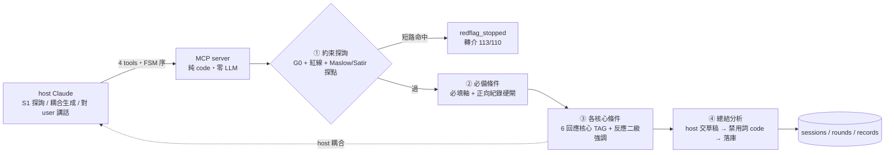
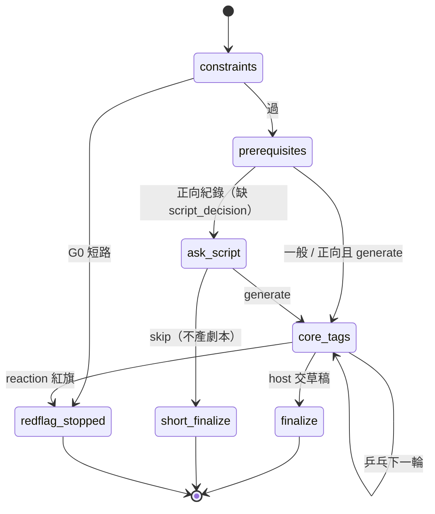

# parenting-response MCP 規格 (v3.0)

> Thin MCP server:**零 LLM 呼叫、零 API key**。對 host 只暴露 4 個工具,server 端 code 強制呼叫順序與安全閘。學派分兩群:**6 回應核心**以靜態 TAG 由 host 一次耦合生成;**2 探詢核心(Maslow/Satir)**前移約束探詢,做診斷不做回應。隔離降為「輸入素材隔離」而非「per-lens 獨立判讀」,換取零推論成本。

## v2.2 → v3.0 轉向

| 維度 | v2.2 | v3.0 |
|---|---|---|
| 推論 | server 自打 Anthropic API（10 核心隔離並行） | **server 零 LLM**;host 耦合生成 |
| API key | 必須 | **不需要** |
| 隔離 | 真隔離（10 次獨立 fresh-context） | 盡量隔離（靜態 TAG 集乾淨,耦合單次） |
| 學派分工 | 10 核心同質產招 | **6 回應核心(耦合) + 2 探詢核心(診斷,前移①)** |
| 核心輸出 | per-situation 段落判讀 | 靜態理念 TAG（加厚） |
| 後檢 | server 在 path 上硬強制 | host 交草稿軟強制（④） |

> **決策定案:** 真隔離需 MCP sampling,Claude client 不支援 → 排除。省錢勝出。

## 目標 / 非目標

| | 內容 |
|---|---|
| 目標 | 零 API key;4-tool FSM code 強制;G0 硬守;後檢軟守;探詢/回應分群;靜態 TAG 盡量隔離;正向紀錄硬閘短鏈;L0 落庫 |
| 非目標 | 真隔離（需 sampling）;server 端推論;per-lens 獨立判讀;L1–L4 聚合 |

## 架構



## FSM（code 強制,違序 `E_INVALID_STATE`）



## Tool 介面（① → ② → ③* → ④;終態 `finalized` / `redflag_stopped` 與 TTL 棄案 `expired` 皆為吸收態）

| # | tool | 輸入契約 | server（純 code） | 過 → | 不過 → |
|---|---|---|---|---|---|
| ① | `constraints`（約束探詢） | `facts / emotion / mode` | G0 短路紅旗;回禁用詞+紅線約束集 + **Maslow/Satir 探點**（引導 S1） | unlock ② | 短路 → `redflag_stopped` |
| ② | `prerequisites` | `age_band / emotion_intensity / problem_category? / script_decision?` | 驗必填軸;正向紀錄且缺 `script_decision` → 回 ask-gate + 詢問語 | unlock ③（或 skip→short ④） | 缺軸 → `E_MISSING_AXIS` |
| ③ | `core_tags` | `session_id / child_reaction? / reaction_note?` | 回 **6 回應核心 TAG**（標 primary/support）+ Erikson/Piaget 查表;reaction 複檢 G0（**高張力輪強制 reaction_note**,缺則 ask-gate;其餘輪有轉述才複檢）;算 `converged` | unlock ④（可重呼 ×n） | reaction 紅旗 → `redflag_stopped` |
| ④ | `finalize` | `session_id / draft / outcome / claimed_sources`<br/>（short 模式:無 draft） | **自由文本 G0 複檢**（短路 → 轉介必達 + severity↑,案照收）;禁用詞 `pattern_check`（short 略過）;落 record | terminal `finalized` | 含禁用詞 → 拒落庫,回違規詞 |

- `child_reaction ∈ 鬆動配合 \| 否認堅持 \| 情緒爆發 \| 退縮害怕 \| 反問試探 \| 轉移打岔`;round 0 = NULL。
- **正向紀錄硬閘:** `problem_category=正向紀錄` 時,② 在收到 `script_decision ∈ skip\|generate` 前**不解鎖任何後續**;skip → short ④（只記事,不產劇本、不 pattern_check）;generate → 一般鏈。`script_decision` 為必填閘(硬),「是否真有問家長」屬 host 配合(軟)。
- **③ 複檢前提(defect-fixes #4):** `child_reaction ∈ {情緒爆發, 退縮害怕}`(高張力)而缺 `reaction_note` → 回 ask-gate(`requires=reaction_note`),不 insert round、不解鎖——紅旗複檢的風險集中在高張力輪,有效性不可繫於 host 自律;非高張力輪無轉述 → 跳過複檢(已知軟點,如實陳述)。
- **④ G0(defect-fixes #2):** `draft / outcome_note / parent_self_note / followup` 一律複檢(short 模式同樣適用,short 只略過 pattern_check);短路命中**不拒收、不改走 redflag_stopped**——④ 紅旗主體多為家長自陳而非進行中乒乓,鎖案無助益;回傳附 `redflag`/`referral` 且 severity 升「高」(警訊級 → 附 `warnings` + severity 升「高」;G0 訊號不因 pattern 拒收而丟失)。
- **④ 前置(defect-fixes #3):** 一般模式須先 ③ `core_tags` 至少一輪(round 0 起手),否則 `E_INVALID_STATE`——host 未取得任何 TAG 不得交稿,學派引導不可整段繞過;short 模式本就免 ③,不受此守衛影響。
- **棄案 TTL(defect-fixes #6):** open 案自**最後活動**(建案或最近一輪,非單看建案時間——乒乓本就跨日)逾 `SESSION_TTL_DAYS`(預設 30,≤0 停用)天,於下次 ① 懶清掃轉吸收態 `expired`:不產 record、`severity` 留存於 sessions 供 L0 追蹤(警訊訊號不隨棄案消失)。
- 違序呼叫明確錯誤,**零 server 成本**。

## 學派 TAG 設計（Approach 1,locked;詳見 `references/cores/tags.md`）

**6 回應核心**（`pd, adler, dreikurs, gottman, rogers, nvc`)→ ③ 回傳,host 耦合;格式:

```text
<school>: { 理念, 套用, 示範, 紅線 }
```

**2 探詢核心**（`maslow, satir`)→ ① 回傳探點,引導 S1 診斷,**不進回應耦合**;格式:

```text
<school>: { 探詢, 探點, 示範問, 紅線 }
```

**反應二級強調（code 二級,非數值權重）** — ③ 依 `child_reaction` 以確定性映射標 `primary`,其餘為 `support`;host 以 primary 領銜耦合。理由:數值權重需 ground-truth 調參,thin 設計產不出;二級強調沿用 v2.2 `ignition_set` 已驗邏輯,零 LLM、直擊糊化。

| child_reaction | primary（限 6 回應核心） |
|---|---|
| 鬆動配合 | pd, adler |
| 否認堅持 | dreikurs, adler, pd |
| 情緒爆發 | gottman, rogers |
| 退縮害怕 | rogers, nvc |
| 反問試探 | nvc, pd |
| 轉移打岔 | gottman, pd |
| round 0（無 reaction） | 6 核心全 primary |

**converged 判定（code 規則,D3 投影;單一來源 = 本表,defect-fixes #5）** — `鬆動配合 ∧ 無警訊 ∧ 自最近一次高張力反應（情緒爆發/退縮害怕）後已有 ≥1 輪鬆動配合`;高張力與鬆動之間夾其他反應**不重置**防線（討好式順從常見軌跡「爆發→嘴硬→順從」不得洗白）;無高張力史 → 首個鬆動即收斂;round 0 恆 False。

| 反應序列（…→ 本輪） | converged |
|---|---|
| （無高張力史）→ 鬆動 | True |
| 爆發 → 鬆動 | False |
| 爆發 → 鬆動 → 鬆動 | True |
| 爆發 → 堅持 → 鬆動 | False |
| 爆發 → 堅持 → 鬆動 → 鬆動 | True |

| 規則 | 說明 |
|---|---|
| 隔離性質 | 乾淨的是**輸入素材（TAG 集）**,非 per-lens 推論;OUTPUT 前 TAG 隔離 ✅,但無獨立判讀 |
| 反糊化 | ④ 強制 host 在 draft 標註「哪招來自哪學派」（`claimed_sources`,軟溯源,**不可驗**） |
| Erikson/Piaget | 不出 TAG,`age_band → stage` 確定性查表 |

## 安全邊界

| 保證 | 強度 | 機制 |
|---|---|---|
| G0 紅旗（短路自傷/虐待 → 轉介;警訊 → severity↑） | **硬（code）** | ① 輸入 + ③ 每輪 reaction + ④ 四個自由文本(④ 命中不拒收:轉介必達 + severity↑) |
| 必填軸 / 正向紀錄 `script_decision` 閘 | **硬（code）** | ②；缺則不解鎖 |
| 禁用詞 `pattern_check` | **硬（code）** | ④ 落庫前;不過拒收 |
| FSM 序 / DB 不變量 / Erikson-Piaget / `converged` / 反應強調映射 | **硬（code）** | server 端 |
| 紅線約束集 | **硬（code）** | ① 回傳 = **8 校(6 回應+2 探詢)紅線聯集 ∪ `wordlists.py` 禁用詞** |
| lens 判讀 | 軟 | 換成 host 對 TAG 集的單次耦合 |
| 溯源 / 「是否真問家長」 / 「只過後檢才到 user」 | 軟（host 配合,**僅誘因,不偵測**） | 緩解:`record_id` / `converged` 藏 ④ 後 |

## 資料模型

> `Database` Protocol 不變（Memory / SQLite / PG 同語意）。後端隨部署:**本地 SQLite;雲端 scale-to-zero demo 用 serverless PG**（現有 `PgDatabase` 不改）。

不變量:

```text
rounds   PK (session_id, round_no)        # 重複輪次寫入必失敗
records  UNIQUE (session_id)              # 一 session 至多一 record
status   UPDATE ... WHERE status='open'   # 併發 finalize 恰一成功
```

records 瘦身（vs v2.2）:

| 欄位 | v3.0 來源 |
|---|---|
| `erikson_stage` / `piaget_stage` / `dev_normative` | `age_band` 確定性查表（保留） |
| `maslow_need` | **① 約束探詢之 Maslow 探點命中**（診斷階段,非回應核心） |
| `dreikurs_purpose` / `posture` | host 自報 `claimed_sources`（不可驗）或 NULL |
| `draft` / `outcome` / `outcome_note` | host 提交（short 模式 `draft=NULL`） |

## 關鍵決策

| 決策 | 取捨方案 | Rationale |
|---|---|---|
| thin server,零 API key | fat+key（真隔離）/ thin（免費） | 不願為他人推論付費;sampling 不支援 |
| 靜態 TAG 耦合 | TAG（免推論）/ 段落判讀（需 key） | 唯一能在零 key 下保「輸入隔離」 |
| Maslow/Satir 歸探詢非回應 | 全進耦合 / 前移診斷 | 二者本為診斷深度,前移①先診斷再回應,深度不被耦合稀釋 |
| 反應強調=code 二級 | 數值權重 / 二級 / 固定 | 數值需調參(thin 產不出);二級沿用 ignition 已驗 |
| 正向紀錄硬閘短鏈 | 全管線 / 硬問後分流 | 正向事件多不需劇本,但「跳過」須家長明示 |
| Erikson/Piaget 查表 | LLM 判讀 / age 查表 | 本就確定性映射,零變異零成本 |
| 後端可換（Protocol） | SQLite / PG 固定 | 部署情境不同（本地 vs 雲端） |

## 驗收條件

- [ ] 給定 ① 未過,當 呼叫 ②③④,則 一律 `E_INVALID_STATE`
- [ ] 給定 G0 短路命中,當 ①,則 `session=redflag_stopped` 且後續鎖死
- [ ] 給定 任一情境,當 ①,則 回傳含 Maslow/Satir 探點（引導 S1）
- [ ] 給定 必填軸缺,當 ②,則 `E_MISSING_AXIS` 且停在 ②
- [ ] 給定 `problem_category=正向紀錄` 且無 `script_decision`,當 ②,則 回 ask-gate 且 ③④ 不解鎖
- [ ] 給定 `script_decision=skip`,當 流程推進,則 走 short ④（`draft=NULL`,不跑 `pattern_check`）
- [ ] 給定 `child_reaction=情緒爆發`,當 ③,則 回 **6 核心**且 `primary={gottman, rogers}`（確定性,不經 LLM）
- [ ] 給定 draft 含禁用詞,當 ④（非 short）,則 拒落庫並回違規詞
- [ ] 給定 任一 `age_band`,當 查 Erikson/Piaget,則 與映射表一致（不經 LLM）
- [ ] server 全程**零 LLM 呼叫**（可斷言:無 LLM client 物件）
- [ ] `converged` 為 code 規則計算（非 host 自報）

## 邊界 / 換掉了什麼

| 換掉 | 換到 |
|---|---|
| 真隔離 → 盡量隔離 | 零 API key |
| per-lens 獨立判讀 → 靜態 TAG 耦合 | 零 server 推論成本 |
| code 驗溯源 → host 自報 | scale-to-zero 友善（狀態全落 DB） |
| 「只過後檢才到 user」硬保證 → host 配合 | 部署極輕 |

風險與緩解:

| 風險 | 緩解 |
|---|---|
| 文案不確定性↑（TAG 引導 vs 段落引導） | TAG 加厚 + 反應二級強調 + 探詢先診斷 |
| 6 學派糊成一團 | primary/support 標記 + ④ 強制 `claimed_sources` |
| host 繞過 ④ / 不真問家長 | 價值（`record_id` / `converged`）藏 ④ 後（誘因制,不偵測） |

> **賣點誠實:** v3.0 是「多學派引導 + 安全閘」,**非**「code 強制獨立判讀」。對外與 demo 一律據此描述。
