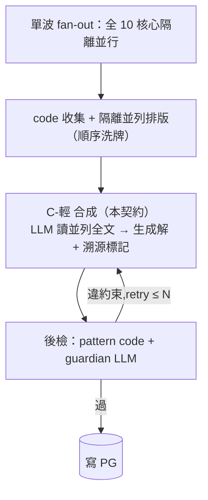

# C-輕 合成契約 (v3)

> **不分族、各核心隔離並列展示、不做加權;讓 LLM 生成解——隨機但有源頭。**
> code 只做:收集、隔離並列排版(順序洗牌)、溯源驗證。LLM 讀全文並列,自行取捨織路徑。硬保證不在本步:安全由上游 G0(情境)與下游後檢(產出)的 code 閘承擔。

## v2 → v3 變更

| 項 | v2 | v3 |
|---|---|---|
| 家族標籤 | code 查表貼 `family` | **全刪**(計票機制移除後標籤無消費端) |
| 折算規則 | 同家族折一票、跨家族強訊號 | **全刪**(不數票) |
| emotion_prior | 情緒強度作權重先驗 | 降為情境事實之一,**不調權重** |
| confidence | 顯示於版面、宣稱不加權 | **從版面移除**(顯示即加權誘因;跨核心不可比) |
| 事前 VETO 過濾 | 管線含 VETO 節點(v2 遺跡) | 刪;對齊 v2.2 單波 + 事後檢 |
| 觀點(Adler) | 輸入契約無槽位 | 補槽位,與候選同格式並列 |
| constraints[] | 只給後檢 | **合成也收**(事前遵守降 retry;硬保證仍在後檢) |
| trace | family_agreement 折算審計 | 瘦身為溯源審計(utterance_sources) |

## 管線位置(對齊 MCP v2.2)



> 本契約只規範 `COL + SYN`。G0(上游)與 CHK(下游)見 MCP-SPEC v2.2。

## 中心原則

| 原則 | 含義 | 由誰保證 |
|---|---|---|
| 不分族 | 無家族標籤、無譜系後設資訊進入版面 | code(版面不含 family 欄,可斷言) |
| 隔離並列 | 每核心一個等格式、等地位區塊;呈現順序每次隨機洗牌 | code(shuffle + 順序落 trace) |
| 不加權 | 無折算、無計票規則、無 confidence、無情緒權重先驗 | code(版面無數值權重欄)+ prompt(不提供取捨公式) |
| 隨機但有源頭 | 同輸入可生不同解(接受);每句話術必可溯源到核心(強制) | LLM 生成 + code 溯源驗證 |

呈現順序洗牌的作用:不分族後,學派同源的多聲音(如 Adlerian 系 3 核心)不再被折算中和——洗牌至少消除**位置固化偏置**,且順序落 trace 供 L1–L4 事後檢驗位置效應。

❌ 多數決:誰被最多核心提就選誰
❌ 折算:同源核心一致算一票
❌ 權重公式:confidence × emotion_prior × ...
✅ LLM 讀全文並列,以情境貼合 + 約束相容自行取捨;產出每句標來源

## 輸入契約

`SYN` 這次 LLM 呼叫收到:

```text
情境摘要      : mode / 年齡帶 / problem_category / 情緒+強度（事實,非權重）/ confounders / parent_goal
約束          : 各約束核心 { analysis, constraints[] }   # 事前遵守;後檢仍逐條驗
並列區塊[]    : 洗牌後順序,每核心一塊,等格式:
                { core, analysis（全文）, candidate（全文話術,産招才有）}
                # 産招 ×5 → analysis + candidate
                # 觀點 ×1（Adler）→ analysis only
                # 無 family、無 confidence、無任何權重欄位
```

## 並列版面(LLM 實際讀到的格式)

```text
【情境】mode=live｜4-6 歲｜物權衝突｜情緒=生氣/高｜confounder=疲累
        家長目的:讓他用說的不動手
【約束（後檢將逐條驗,事前遵守）】
  Maslow  : 勿為矯正犧牲歸屬（需求不踩底）
  Satir   : 勿貼標籤;護「他不是壞孩子,是想守住東西」（不損自我）
  Erikson : 主動期,占有屬常態（不超齡-心理社會）
  Piaget  : 前運思,所有權概念未穩;規則講具體（不超齡-認知）
【核心輸出(隔離並列,順序隨機)】
  [NVC]      analysis: ...    candidate: 觀察不評價 → "我看到妹妹拿了你的車"
  [Adler]    analysis: 私人邏輯=用搶宣示掌控;歸屬感受挫   （無 candidate）
  [Gottman]  analysis: ...    candidate: 先命名情緒 → "你很氣車被拿走對不對"
  [PD]       analysis: ...    candidate: 連結先於矯正 → "我懂你很想要回車"
  [Rogers]   analysis: ...    candidate: 無條件接住 → "不管怎樣我都在"
  [Dreikurs] analysis: ...    candidate: 退出權力爭奪 + 有限選擇
```

## 生成規則(LLM)

不提供計票或折算公式;取捨由生成決定。僅約束**輸出結構**:

1. 遵守全部 constraints(後檢會逐條驗,違者退回重生)
2. 可織多核心、可只取一源、可自行措辭——但起手話術**每句標來源核心** `[Gottman]`/`[NVC]`…;自行措辭處標最近源頭
3. 方向分歧不壓平:於「觀察點」攤開張力 + 各自下一步
4. 放下的方向可簡記一句理由(供審計,非辯護)

## 合成輸出

產出 v2 建議卡(判讀 / 姿態 / 起手話術 / 觀察點 / 界線 / 紅線);本步特有:

| 卡欄位 | 由 SYN 填 |
|---|---|
| 姿態 | 生成的路徑(可跨核心) |
| 起手話術 | 2–3 句,每句標來源核心 |
| 觀察點 | 含分歧分支:看哪個反應 → 各自下一步 |
| 來源摘要 | 取用了誰、放下了誰+一句理由(取代 v2 共振摘要) |

## trace 審計 schema(瘦身版)

```yaml
synthesis_trace:                      # schema_version: 3
  inputs_seen: [PD, Dreikurs, Gottman, NVC, Rogers, Adler]   # 可用核心;缺席者標 unavailable
  presentation_order: [NVC, Adler, Gottman, PD, Rogers, Dreikurs]  # 洗牌結果,審位置效應
  utterance_sources:                  # code 可驗（溯源核心）
    - { utterance: "你很氣車被拿走對不對", core: Gottman }
    - { utterance: "我懂你很想要回車",     core: PD }
  set_aside:
    - { core: NVC, reason: "情緒高,觀察句延後" }
  divergences_surfaced:
    - { tension: "先情緒 vs 先講所有權", surfaced_in: 觀察點 }
```

code 驗證器(後檢前置,零 LLM 成本):

```text
utterance_sources 每項 core ∈ inputs_seen            → 否則退回重生
起手話術每句皆有來源標記                              → 否則退回重生
trace 不得含 family / confidence / 權重欄位（防回歸） → schema 拒收
```

## 與 fence 的邊界

```text
G0（code,上游）   : 紅旗情境短路,根本不進合成
SYN（本契約）     : 讀全候選（含不理想者）;生成自由,結構受限（溯源+分歧攤開+遵約束）
後檢（code+LLM,下游）: pattern 禁用詞 + guardian 逐條驗 constraints → 違者退回;上限降級
```

> 合成看得到不理想候選是 v2.1+ 的刻意設計:湧現違規只有檢產出抓得到。LLM 沒有重開安全洞的路徑——不是因為它只見過安全候選,而是**違約束的產出出不了後檢**。

## 關鍵決策

| 決策 | 取捨方案 | Rationale |
|---|---|---|
| 不分族、不折算 | 家族折算 / 不數票 | 計票機制移除後標籤無消費端;偽共識的安全面由後檢硬 fence 承擔,風味面接受(見已知風險) |
| 隨機性 = 接受 | 固定 seed 求重現 / 接受隨機 | 育兒解本無唯一正解;同輸入不同解是特性;可重現性由 trace 溯源取代 |
| 溯源 = 強制 | 自由生成 / 句句標源 | 「隨機但有源頭」的源頭半邊;審計與 L1–L4 歸因都靠它 |
| 呈現順序洗牌 | 固定順序 / 洗牌 | 不折算後的最小去偏置手段;零成本,順序落 trace 可驗位置效應 |
| confidence 移出版面 | 顯示不加權 / 不顯示 | 顯示即加權誘因且不可執行;跨核心自評不可比 |
| 合成收 constraints[] | 只給後檢 / 兩端都給 | 事前遵守降 retry(每次 retry = +2 LLM);硬保證點不變仍在後檢 |
| trace 每輪全量 | delta / 全量 | 乒乓輪數小;delta 重建邏輯是新 bug 面 |

## 已知風險(接受,不處理)

- **學派音量偏置**:Adlerian 系(PD/Dreikurs/Adler)佔並列版面 3/10 區塊,語彙曝光量天然較高,LLM 取捨可能長期偏向該風味。安全不受影響(fence 不變);風味偏置是否實際發生 → L1–L4 以 `utterance_sources` 統計核心取用率實證,屆時再議,不預先工程化。

## 驗收條件

code 部分:

- [ ] 給定並列版面,當排版,則不含 family / confidence / 任何權重欄位(可斷言)
- [ ] 給定多次相同輸入,當排版,則 presentation_order 非恆定(洗牌生效)且落 trace
- [ ] 給定話術句缺來源標記或來源 ∉ inputs_seen,當 code 驗證,則退回重生,零 LLM 成本
- [ ] 給定 trace 含 family_agreement 類結構,當 schema 驗,則拒收(防回歸)

合成部分(eval,讀 trace 判斷):

- [ ] 給定方向分歧,當合成,則「觀察點」攤開張力,非強行擇一
- [ ] 給定任一 constraint,當合成,則產出不違反(由後檢覆驗)
- [ ] 給定 set_aside 非空,當讀 trace,則各項含一句理由

## 對 MCP v2.2 主規格的連動修改

| 位置 | 改動 |
|---|---|
| 編排管線 SYN 節點 | 「讀 候選+約束+analysis(家族標籤)」→ 去「家族標籤」,改「隔離並列(洗牌)」 |
| 關鍵決策表 | 「同模 + 家族折算」整行刪除,替換為本契約「不分族」決策 |
| rounds 表 | `resonance_trace` 欄名改 `synthesis_trace`(尚未實作,改名零成本);schema_version=3 |
| record-schema.md(待產) | 不收 family 受控詞表;收 `utterance_sources` 核心取用統計欄位定義 |
| 元件職責表 | 合成:「C-輕 + code 貼標」→「C-輕 + code 排版/洗牌/溯源驗證」 |

## 待議

- 洗牌粒度:整塊洗 vs 産招/觀點分區內各自洗(目前:整塊洗,最簡)
- rehearsal 重抽:同輸入想要第二個解 → 目前開新 session(YAGNI,不加 re-roll 介面)
- guardian 與合成異質(跨 vendor)→ 沿 MCP v2.2 backlog
